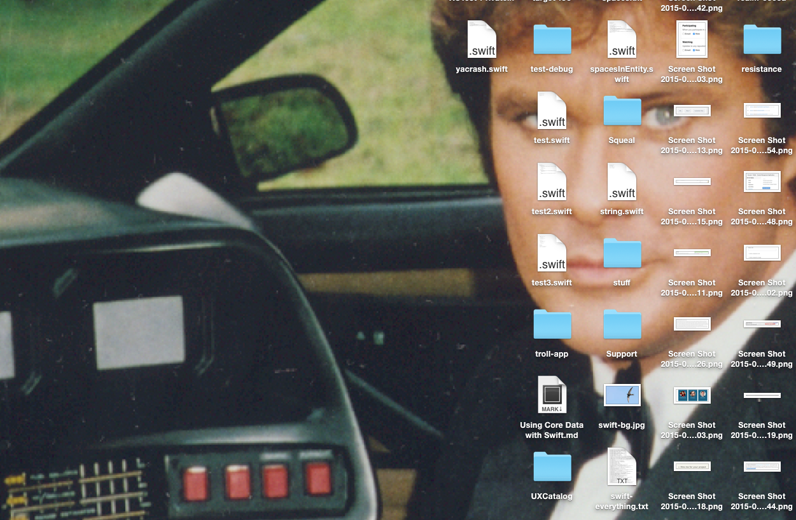

# Hasselhoff

Saves you the hassle of setting a Hoff desktop picture manually.

## Installation

    $ gem install hasselhoff

## Usage

Simply

	$ hasselhoff

💥

## TODO

It is hard to actually set the picture for all spaces, so this unfortunately
only works for the current space 😭.

## Contributing

1. Fork it ( https://github.com/[my-github-username]/hasselhoff/fork )
2. Create your feature branch (`git checkout -b my-new-feature`)
3. Commit your changes (`git commit -am 'Add some feature'`)
4. Push to the branch (`git push origin my-new-feature`)
5. Create a new Pull Request
